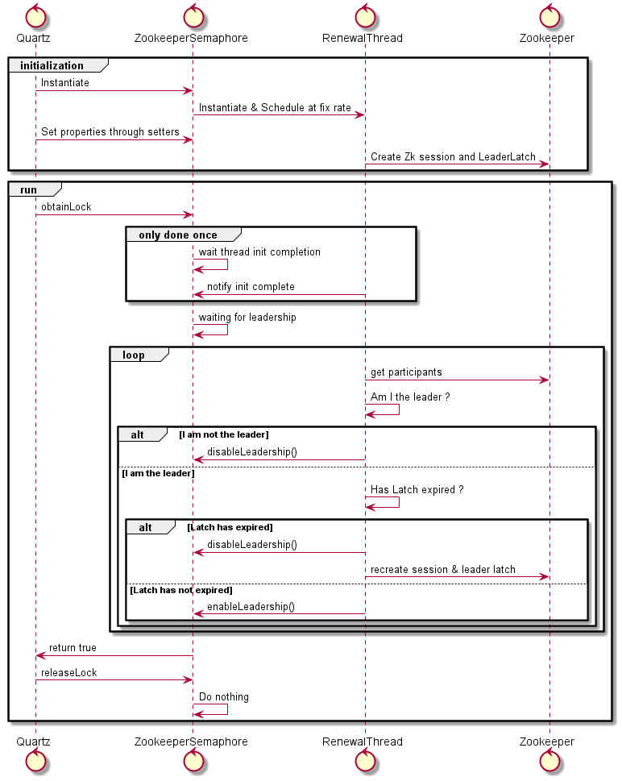

Quartz Zookeeper Semaphore
======================================================

The purpose of this repository is to implement a [Quartz Scheduler](http://www.quartz-scheduler.org/) semaphore using [Apache Zookeeper](https://zookeeper.apache.org/).

Use case
---

Quartz scheduler offer cluster aware job scheduling through the usage of RDBMS locks. This can lead to performance issues depending on the workload as described in Quartz documentation :

> the clustering feature works best for scaling out long-running and/or cpu-intensive jobs (distributing the work-load over multiple nodes). If you need to scale out to support thousands of short-running (e.g 1 second) jobs, consider partitioning the set of jobs by using multiple distinct schedulers (including multiple clustered schedulers for HA). The scheduler makes use of a cluster-wide lock, a pattern that degrades performance as you add more nodes (when going beyond about three nodes - depending upon your database’s capabilities, etc.).

Moreover, due to the simple nature of the lock semantic, it can also lead to unbalanced cluster where only one node does all the work.

Quartz allows one to override the default behavior by providing an implementation of [Semaphore](https://github.com/quartz-scheduler/quartz/blob/master/quartz-core/src/main/java/org/quartz/impl/jdbcjobstore/Semaphore.java) interface through the `org.quartz.jobStore.lockHandler.class` property.

The implementation proposed in this repository aim to provide a Semaphore with the properties below :

* *Deterministic leader election* to ease design and debug
* *Balanced load management* for performance and resilience
* *Sharding capabilities* to slice the cluster if required to do so

Given three nodes inside the *Quartz cluster*, leadership should go like :

Node1 (X sec) -> Node 2 (X sec) -> Node 3 (X sec) -> Node1 (X sec) -> Node2 (X sec)....    

Design
---

The implementation is largely based on [Curator LeaderLatch recipe](https://curator.apache.org/curator-recipes/leader-latch.html) which is extended with an expiration concept to periodically handover the leadership.
Due to the [ephemeral and sequential nature of the ZNode](https://zookeeper.apache.org/doc/r3.5.4-beta/recipes.html#sc_leaderElection) created by the *LeaderLatch*, renewing periodically the *LeaderLatch* will put the node at the end of the waiting queue and thus enable a deterministic cycle.
Conceptually, it works as described below :




Configuration
---

To use the Zookeeper semaphore, you must supply the properties below  to Quartz:

```properties
org.quartz.jobStore.lockHandler.class: fr.syalioune.scheduling.quartz.semaphore.ZookeeperSemaphore
org.quartz.jobStore.lockHandler.zookeeperConnectString: localhost:2181
org.quartz.jobStore.lockHandler.zookeeperLockPath: /quartz/leader
org.quartz.jobStore.lockHandler.zookeeperAuthUsername: tbd
org.quartz.jobStore.lockHandler.zookeeperAuthPassword: tbd
org.quartz.jobStore.lockHandler.zookeeperAuthScheme: tbd
org.quartz.jobStore.lockHandler.zookeeperRetryMs: 100
org.quartz.jobStore.lockHandler.nodeId: ${server.port}
org.quartz.jobStore.lockHandler.leadershipPeriodMs: 120000
```

| Property                                               | Role                                                                                                                                                                                   |
|--------------------------------------------------------|----------------------------------------------------------------------------------------------------------------------------------------------------------------------------------------|
| org.quartz.jobStore.lockHandler.class                  | The class implementing Quartz Semaphore interface (i.e : fr.syalioune.scheduling.quartz.semaphore.ZookeeperSemaphore). It will be instantiated by Quartz using the no-arg constructor  |
| org.quartz.jobStore.lockHandler.zookeeperConnectString | Zookeeper connect string                                                                                                                                                               |
| org.quartz.jobStore.lockHandler.zookeeperLockPath      | Zookeeper ZNode path used to implement the LeaderLatch recipes. Make sure it is unique per Quartz Scheduler                                                                            |
| org.quartz.jobStore.lockHandler.zookeeperAuthUsername  | Zookeeper username if needed. It will be concatenated with password to create a digest (i.e: username:password)                                                                        |
| org.quartz.jobStore.lockHandler.zookeeperAuthPassword  | Zookeeper password if needed. It will be concatenanted with username to create a digest (i.e: username:password)                                                                       |
| org.quartz.jobStore.lockHandler.zookeeperAuthScheme    | Zookeeper authentication scheme                                                                                                                                                        |
| org.quartz.jobStore.lockHandler.zookeeperRetryMs       | Zookeeper connection retry delay in case of failure. Please be advised that a RetryForeverPolicy is used                                                                               |
| org.quartz.jobStore.lockHandler.nodeId                 | Unique identifier of the node for the leader election                                                                                                                                  |
| org.quartz.jobStore.lockHandler.leadershipPeriodMs     | Leadership lease period. After that period of time, the Zookeeper session and LeaderLatch will be closed and recreated                                                                 |

Demo application
---

A [Spring boot demonstration application](./spring-demo-application) is provided to get a grasp of how to use the Semaphore.
Follow the steps below to use it.

## Classic

1. Start a [Postgresql](https://www.postgresql.org/) database
2. Start an [Apache Zookeeper](https://zookeeper.apache.org/) instance
3. Adapt the properties in [application-postgres.yml](spring-demo-application/src/main/resources/application-postgres.yml)
4. Run the command

```shell
mvn clean install
cd spring-demo-application
java -Dspring.profiles.active=postgres -Dserver.port=8080 -jar target/spring-demo-application-<version>.jar
java -Dspring.profiles.active=postgres -Dserver.port=8080 -jar target/spring-demo-application-<version>.jar
java -Dspring.profiles.active=postgres -Dserver.port=8080 -jar target/spring-demo-application-<version>.jar
```

## Docker-compose

```shell
cd docker-compose
docker-compose up --scale quartz-demo=3
```

Development
---

## Requirements

To work with this project, the following tools are needed :

1. [JDK 11](https://adoptopenjdk.net/)
2. [Maven 3](https://maven.apache.org/download.cgi)
3. [Zookeeper 3.4.13](https://zookeeper.apache.org/)
4. [Postgresql](https://www.postgresql.org/)

## Compilation and Unit tests

```shell
  mvn clean test
```

## Run on development workstation

1. Default profile

```shell
  mvn -pl spring-demo-application spring-boot:run
```

2. Postgres profile

```shell
  mvn -pl spring-demo-application spring-boot:run -Dspring-boot.run.profiles=postgres -Dserver.port=8080
```

## Packaging

```shell
  mvn clean install
```

# Docker image build and push

```shell
  cd spring-demo-application
  mvn -Ddocker.hub.token=<TOKEN> spring-boot:build-image
```

# TODO

1. Conditional fallback on `org.quartz.impl.jdbcjobstore.StdRowLockSemaphore` whenever Zookeeper is not available
2. Kubernetes deployment with prometheus/grafana monitoring

